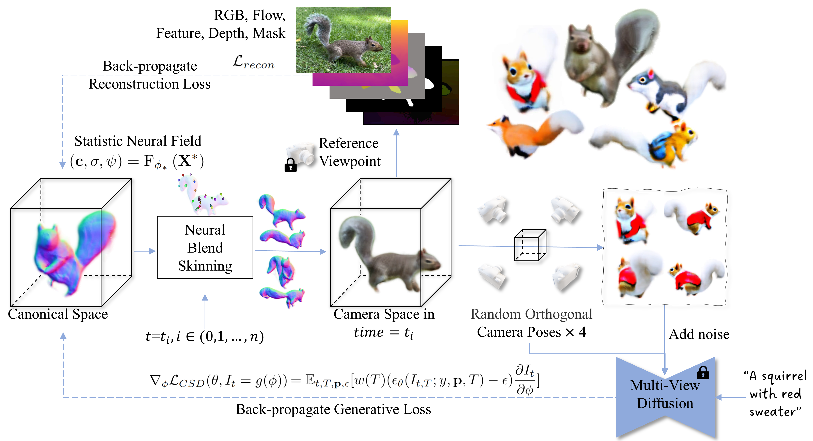

# AnimatableDreamer
Offical implementation of the paper "AnimatableDreamer: Text-Guided Non-rigid 3D Model Generation and Reconstruction with Canonical Score Distillation"

<a href='https://animatabledreamer.github.io/'></a> <a href='https://arxiv.org/abs/2312.03795'></a> 



The code will be released after our paper is accepted.

## Citation	

```
@misc{wang2023animatabledreamer,
      title={AnimatableDreamer: Text-Guided Non-rigid 3D Model Generation and Reconstruction with Canonical Score Distillation}, 
      author={Xinzhou Wang and Yikai Wang and Junliang Ye and Zhengyi Wang and Fuchun Sun and Pengkun Liu and Ling Wang and Kai Sun and Xintong Wang and Bin He},
      year={2023},
      eprint={2312.03795},
      archivePrefix={arXiv},
      primaryClass={cs.CV}
}
```
